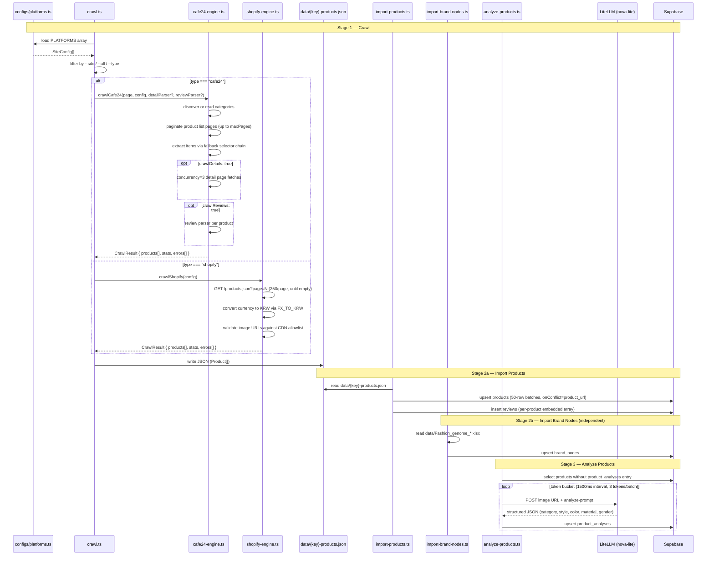

# Codemap: Data Flow

## Full Pipeline Sequence



## Data Volatility

| Data store | Volatility | Notes |
|-----------|-----------|-------|
| `data/{key}-products.json` | Volatile | Gitignored. Overwritten on each crawl run. Safe to delete — re-run `pnpm crawl` to regenerate. |
| Supabase `products` | Persistent | Upserted on conflict key `product_url`. Running import twice is idempotent for existing URLs. New URLs are inserted. |
| Supabase `reviews` | Persistent | Inserted without conflict handling. Duplicate runs may create duplicate review rows. |
| Supabase `brand_nodes` | Persistent | Upserted. Source data is the manually maintained XLSX file. |
| Supabase `product_analyses` | Persistent | Upserted. Re-running analyze-products.ts will re-analyze only products with no existing analysis entry. |

## Stage Independence

Each stage can be run independently:

- `pnpm crawl` — requires only the upstream site being reachable. No Supabase.
- `pnpm import:products` — requires `data/{key}-products.json` to exist. Requires Supabase. Does not require a browser.
- `pnpm import:brand-nodes` — requires `data/Fashion_genome_*.xlsx` to exist. Requires Supabase. No crawl needed.
- `pnpm analyze:products` — requires Supabase `products` rows to exist. Requires LiteLLM proxy. No crawl or JSON file needed.

This independence means failures in one stage do not require restarting the entire pipeline.

## Supabase as Data Contract

```
crawler (this repo)
  │
  │  WRITE ONLY
  │  products, reviews, brand_nodes, product_analyses
  ▼
Supabase
  │
  │  READ ONLY
  │  portal.ai queries product data for user-facing display
  ▼
portal.ai (endurance-ai/portal)
```

The crawler never reads from Supabase except in `analyze-products.ts`, which reads `products` rows to find unanalyzed items. It does not read schema, migrations, or any table it does not also write to.

## Error Handling Pattern

- Engine errors (network, selector, parse): collected in `CrawlResult.errors[]`, logged, and do not abort the crawl. A failed product is skipped.
- Import errors (Supabase upsert failures): logged per batch. A failed batch is logged and the script continues with the next batch.
- Analyze errors (LiteLLM call failures): logged per product. The product is skipped and the token bucket continues.

There is no retry mechanism or dead-letter queue. Failed items are re-attempted on the next full pipeline run.
