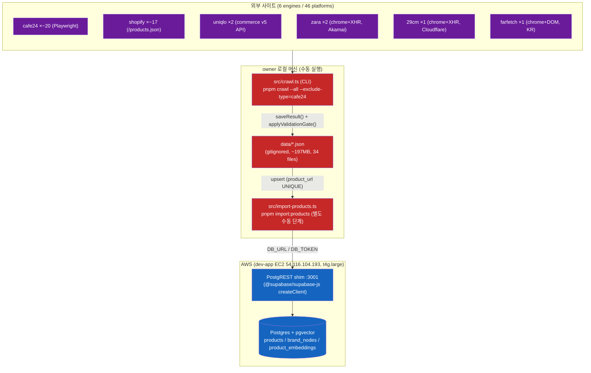
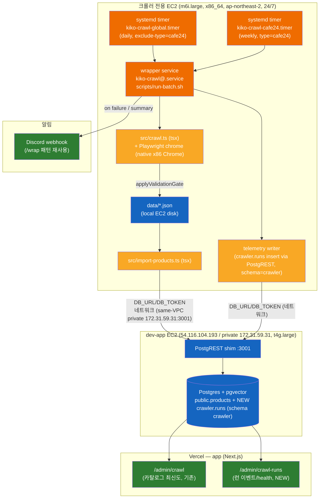
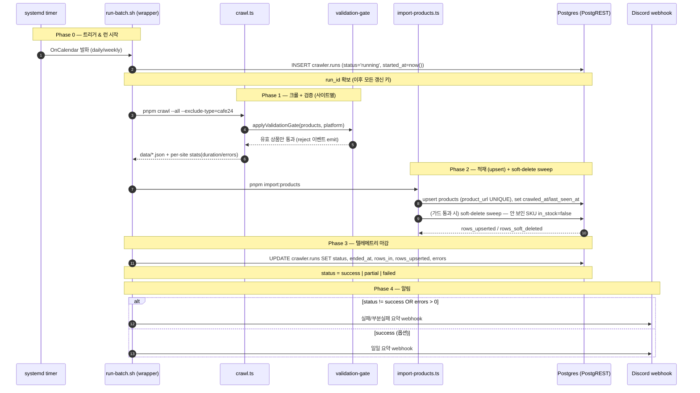
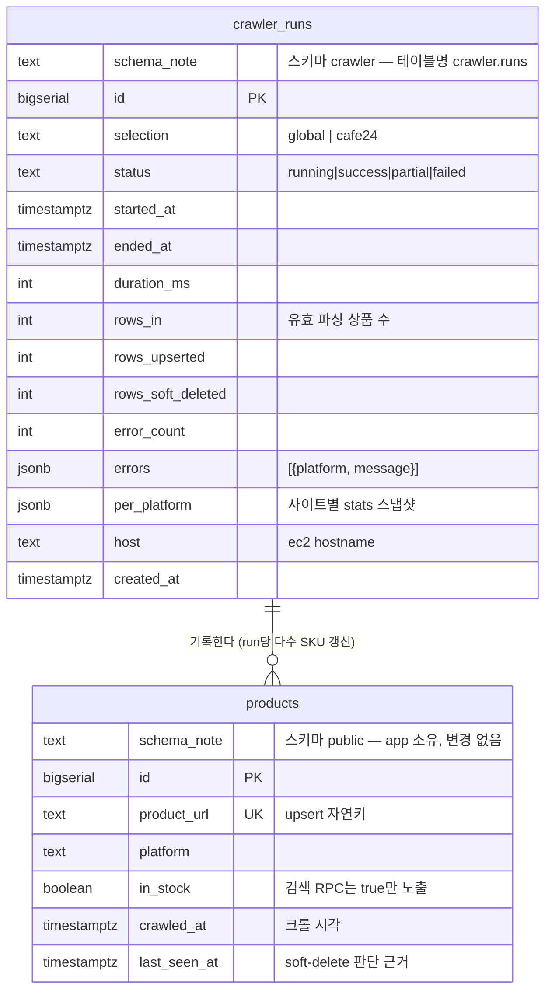
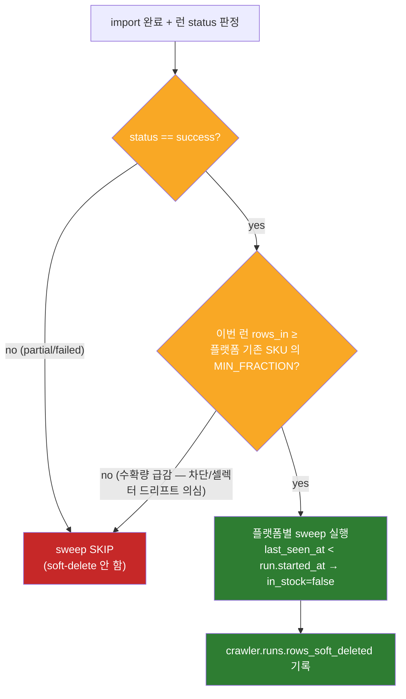
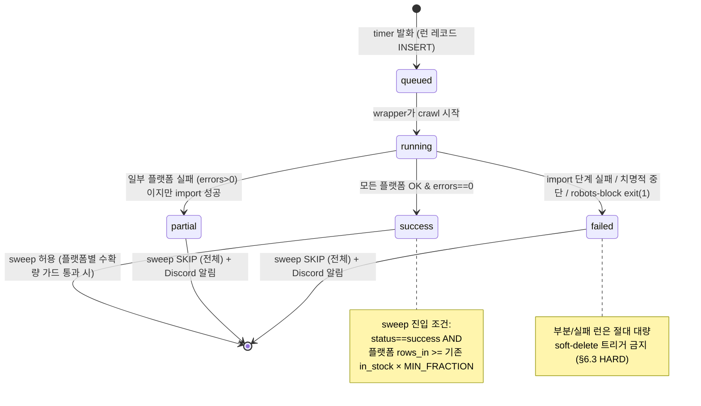

# 크롤러 지속 운영 아키텍처 (operations)

> 작성일: 2026-05-22
> 상태: 설계(미구현) — 본 문서는 **설계/아키텍처 문서**다. systemd unit / SQL migration / admin 코드 / CI yaml 은 본문 안의 스니펫으로만 존재하며, 실제 산출물은 승인 후 별도 작업에서 만든다.
> 실행 환경(owner 확정): 크롤러는 **전용 m6i.large (2 vCPU / 8 GB RAM, x86_64), ap-northeast-2(Seoul), 24/7 상시 가동** EC2 인스턴스에서 돈다. dev-app(t4g.large) 와는 **별도 인스턴스**다. 비용은 고려 대상이 아니며, RAM 헤드룸 + x86 네이티브 Chrome 을 위해 선택됐다.
> 대상·목적: 한상호(owner) + ML/LLMOps 검토 지인. 신규 합류자가 이 문서 하나로 "크롤러를 어떻게 사람 손 없이 매일 돌리고, 결과를 어떻게 보고/감시하고, 품절·삭제를 어떻게 반영하는가"의 그림을 그릴 수 있어야 한다.
> 검증 기준: 본 문서의 모든 구조적 사실은 `crawler` 리포(`src/crawl.ts`, `src/import-products.ts`, `src/lib/**`, `package.json`, `.github/workflows/ci.yml`)와 `app` 리포(`database/migrations/`, `src/domains/admin-tools/`, `src/app/admin/`, `src/repositories/clients/postgrest.ts`)의 실제 코드를 직접 읽고 작성했다. 추정은 `⚠️ 가정:` 으로 명시했다.

---

## 0. 한 줄 요약

오늘 owner 로컬에서 **손으로** `pnpm crawl` → `pnpm import:products` 2단계를 돌리는 흐름을, **전용 크롤러 EC2(m6i.large, x86_64) 위 systemd timer**가 매일 자동으로 `crawl → validate → import → telemetry → alert` 까지 체이닝하도록 만들고, 그 결과를 새 `crawler.runs` 텔레메트리 테이블(전용 `crawler` 스키마) + `/admin/crawl-runs` 어드민 페이지로 가시화하며, 재크롤 시 사라진 SKU 를 `in_stock=false` 로 안전하게 soft-delete 하는 — **지속 가능 운영 체계**를 설계한다. 크롤러는 별도 인스턴스이므로 DB(dev-app Postgres + PostgREST shim)에는 **네트워크 너머로** 접속한다.

---

## 1. 현재 구조 (as-is)

### 1.1 토폴로지: 전부 owner 로컬 수동



빨간색 = 사람이 매번 손으로 트리거해야 하는 지점. 자동화/스케줄/알림이 **전혀 없다**.

### 1.2 2단계 수동 파이프라인

| 단계 | 명령 | 코드 위치 | 산출물 | 검증 게이트 |
|---|---|---|---|---|
| 1. crawl | `pnpm crawl --all --exclude-type=cafe24` | `src/crawl.ts:runCrawl()` | `data/{key}-products.json` | `saveResult()` → `applyValidationGate()` (`src/lib/core/validation-gate.ts`) — 유효 상품만 write |
| 2. import | `pnpm import:products` | `src/import-products.ts` | Postgres `products` upsert | 같은 `applyValidationGate()` 재적용 + FX 환산(`src/lib/fx.ts`) |

핵심 사실:
- 두 단계는 **분리**돼 있고, 1→2 사이에 사람이 끼어든다 (1 끝나면 결과 보고 손으로 2 실행).
- `crawl` 은 `.env`, `import` 은 `.env.local` 로 dotenv 컨텍스트가 다르다 (`package.json` scripts).
- engine 별 동시성 정책이 이미 코드에 박혀 있다: cafe24 `PARALLEL_LIMIT=3` 브라우저 / zara·29cm·farfetch 각자 자기 브라우저로 sequential / shopify sequential 5초 inter-site delay(HTTP 429 회피) / uniqlo fetch 병렬.
- 모든 상품 fetch 전 `checkRobots()` pre-flight 가 blanket `Disallow: /` 면 `process.exit(1)` (HARD rule #1, fail-closed).

### 1.3 지속가능성 갭

| 갭 | 현재 상태 | 영향 | 본 설계가 메우는 스코프 |
|---|---|---|---|
| 스케줄/오케스트레이션 | 없음 (README "systemd timer / cron (TBA)") | 매일 사람이 기억해서 손으로 실행 | (a) |
| crawl→import 체이닝 | 사람이 수동 연결 | 누락/순서 실수 가능 | (a) |
| 런 단위 관측 | 없음 (`crawler.runs` 텔레메트리 테이블 자체가 없음) | 어제 크롤이 성공했는지 DB만 봐선 모름 | (b),(e) |
| 실패 알림 | 없음 | 조용히 실패 → 며칠 stale 후 발견 | (b) |
| CI 품질 | `pnpm typecheck` 만 | 테스트 회귀/lint 누락 방치 | (c) |
| 품절/삭제 반영 | upsert-only (사라진 SKU 영원히 in_stock=true) | 검색 결과에 죽은 상품 노출 | (d) |
| 운영 가시성 | RPC `admin_crawl_platform_stats()` = **카탈로그 최신도**만 (이벤트 아님) | 런 자체의 health 를 볼 화면 없음 | (e) |

> 참고: 기존 `/admin/crawl` 페이지(`app/src/app/admin/crawl/page.tsx` + RPC `admin_crawl_platform_stats()`, migration 078)는 **상품 레벨 집계**(플랫폼별 sku_count, last_crawled_at=MAX(crawled_at), stale_count, 채움률)다. 배치 **런 이벤트**(언제 돌았고, 몇 초 걸렸고, 몇 행 들어왔고, 실패했는지)는 기록하지 않는다. 본 설계의 (e)는 이를 대체하지 않고 **보완**한다.

---

## 2. 목표 아키텍처 (to-be)

### 2.1 dev-app EC2 + systemd 토폴로지



크롤러 EC2(주황/노랑)와 dev-app EC2(파랑)는 **별도 인스턴스**다. 둘 사이 DB 쓰기는 더 이상 localhost 가 아니라 **VPC 네트워크 너머**로 일어난다 — 이게 새 운영 요건이다(§3.2, R-NET).

**왜 전용 m6i.large x86_64 인가** (owner 확정): (1) 8 GB RAM 헤드룸으로 cafe24 3-병렬 브라우저 + zara/farfetch Chrome 메모리를 여유 있게 수용. (2) **x86_64 이므로 `playwright install chrome` 가 네이티브 Google Chrome 을 설치**해 zara/farfetch 의 Akamai/Cloudflare 우회(`channel:'chrome'` 필수)가 보장된다. (3) dev-app 워크로드와 격리 — 크롤이 무거워도 검색/임베딩 호스트에 영향 없음. 비용은 고려 대상이 아니다(owner 명시).

### 2.2 배치 런 라이프사이클 (crawl → validate → import → telemetry → alert)



---

## 3. 스코프 (a) 스케줄 + 오케스트레이션

### 3.1 설계

- **타이머 2종 분리** (engine 비용 특성이 다름):
  - `kiko-crawl-global.timer` — daily. `--all --exclude-type=cafe24` (글로벌 17 shopify + uniqlo + zara + 29cm + farfetch). README/코드의 기존 cron 컨벤션 그대로.
  - `kiko-crawl-cafe24.timer` — weekly (덜 자주). `--type=cafe24`. Cafe24 KR 자사몰은 변동이 느리고 Playwright 3-병렬 메모리 부담이 가장 크므로 분리.
- **wrapper 스크립트가 crawl→import 를 체이닝**하고, crawl_runs 에 런 레코드를 쓰고, 실패 시 Discord 로 알림.
- **부분 실패 허용**: 한 사이트 실패가 전체를 죽이지 않음(이미 `crawl.ts` 의 try/catch per-site 가 그렇게 동작). wrapper 는 종료 코드와 errors 카운트로 `success/partial/failed` 를 판정.
- **재시도**: crawl 단계는 사이트별 자체 복원력에 맡기고, wrapper 수준에서는 import 단계만 1회 재시도(일시적 PostgREST 5xx 대비).

### 3.2 제공: 크롤러 전용 EC2 프로비저닝 (m6i.large, x86_64)

```bash
# === 제안 — 크롤러 전용 EC2 (m6i.large, x86_64 Amazon Linux 2023) 1회 프로비저닝 ===
# [배치 위치 — dev-app 과 동일 VPC/서브넷에 띄운다 (live AWS describe 로 확인)]
#   VPC    = vpc-033f88906f2f4a1ae   (dev-app i-033e3d2edcdeaa8c6 + dev-ai 공유)
#   subnet = subnet-05279e0b19e1e454d  /  AZ = ap-northeast-2d (Seoul)
#   → 같은 서브넷이므로 dev-app private IP (172.31.59.31) 로 바로 접속 가능.
#
# Node 22 (x86_64)
curl -fsSL https://rpm.nodesource.com/setup_22.x | sudo bash -
sudo dnf install -y nodejs
corepack enable && corepack prepare pnpm@10.33.2 --activate

# 리포 클론 + 의존성
git clone <crawler-repo> /opt/kiko-crawler && cd /opt/kiko-crawler
pnpm install --frozen-lockfile

# Playwright Chrome (x86_64) — zara/farfetch 는 channel:'chrome' 필수 (Akamai/Cloudflare bypass).
# x86_64 에서는 `playwright install chrome` 가 네이티브 Google Chrome 을 설치하므로
# 우회 경로가 보장된다 (ARM64 불확실성 없음 — owner 가 이 때문에 x86 를 선택).
pnpm exec playwright install chrome
sudo pnpm exec playwright install-deps   # x86_64 시스템 라이브러리

# === DB 접속: 네트워크 너머 (크롤러는 dev-app 과 별도 인스턴스) ===
# .env / .env.local 배치 — DB_URL 은 더 이상 localhost 가 아니다.
#   same-VPC 확정 → dev-app private IP 사용:  DB_URL=http://172.31.59.31:3001
#   (구) 크롤러는 public 54.116.104.193:3001 을 썼으나, 새 박스는 private 로 전환.
#   DB_TOKEN=<service token>
# [확인된 사실] dev-app SG sg-0710d831cb6fa1094 의 inbound 3001 은 이미 열려 있음
#   (0.0.0.0/0 + 일부 /32). 도달성 확인: curl http://54.116.104.193:3001/ → HTTP 404 (0.02s, PostgREST alive).
# [권장] same-VPC 로 들어왔으니, SG 3001 의 source 를 0.0.0.0/0 대신 크롤러 EC2 의 SG 로
#   좁히는 게 바람직 (§9 R-SEC 와 함께 — 단 이번 자동화 스코프 밖).

# 프로비저닝 검증: 네이티브 Chrome + DB 도달성 둘 다 확인
pnpm crawl --probe=zara-kr            # x86 native Chrome 우회 동작 확인
curl -fsS "$DB_URL/" >/dev/null && echo "DB reachable" || echo "DB UNREACHABLE — SG/IP 확인"
```

### 3.3 제공: systemd unit (timer + templated service)

```ini
# === 제안 — /etc/systemd/system/kiko-crawl@.service ===
# templated service. instance 이름(%i)으로 어떤 셀렉션을 돌릴지 구분.
[Unit]
Description=kiko.ai crawler batch (%i)
After=network-online.target
Wants=network-online.target

[Service]
Type=oneshot
User=ec2-user
WorkingDirectory=/opt/kiko-crawler
# %i = "global" | "cafe24" — run-batch.sh 가 셀렉션을 매핑
ExecStart=/opt/kiko-crawler/scripts/run-batch.sh %i
# Playwright 3-병렬 + chrome 메모리 — m6i.large(8GB) 보호용 상한 (§7 리스크)
MemoryMax=6G
TimeoutStartSec=7200
Nice=10

[Install]
WantedBy=multi-user.target
```

```ini
# === 제안 — /etc/systemd/system/kiko-crawl-global.timer ===
[Unit]
Description=Daily global crawl (exclude cafe24)

[Timer]
# KST 04:30 = UTC 19:30. 트래픽 낮은 새벽.
OnCalendar=*-*-* 19:30:00 UTC
Persistent=true
Unit=kiko-crawl@global.service

[Install]
WantedBy=timers.target
```

```ini
# === 제안 — /etc/systemd/system/kiko-crawl-cafe24.timer ===
[Unit]
Description=Weekly cafe24 crawl

[Timer]
# 매주 일요일 KST 05:00 = UTC Sun 20:00
OnCalendar=Sun *-*-* 20:00:00 UTC
Persistent=true
Unit=kiko-crawl@cafe24.service

[Install]
WantedBy=timers.target
```

### 3.4 제공: wrapper 오케스트레이션 (`scripts/run-batch.sh`, 의사코드 수준 셸)

```bash
#!/usr/bin/env bash
# === 제안 — scripts/run-batch.sh (crawler 리포에 신규) ===
# crawl → import → telemetry → alert 를 한 런으로 체이닝.
# crawler.runs 쓰기/Discord 알림은 작은 tsx 헬퍼(src/ops/*.ts)로 위임한다
# (PostgREST 클라이언트를 이미 가진 import 경로와 동일 패턴 재사용).
set -uo pipefail
SELECTION="${1:-global}"

case "$SELECTION" in
  global) CRAWL_ARGS="--all --exclude-type=cafe24" ;;
  cafe24) CRAWL_ARGS="--type=cafe24" ;;
  *) echo "unknown selection: $SELECTION"; exit 2 ;;
esac

# Phase 0 — DB 네트워크 도달성 선검사 (크롤러는 dev-app 과 별도 인스턴스 → R-NET).
#   크롤을 시작하기 전에 PostgREST shim 에 닿는지 확인. 닿지 않으면 import 가
#   전부 실패할 운명이므로 크롤 자체를 돌리지 않고 즉시 알림 후 종료한다.
if ! curl -fsS --max-time 5 "$DB_URL/" >/dev/null; then
  pnpm -s ops:alert --message="DB unreachable ($DB_URL) — SG/private IP 확인 필요. 크롤 skip."
  exit 3
fi

# Phase 0 — 런 시작 레코드 (run_id 반환)
RUN_ID="$(pnpm -s ops:run-start --selection="$SELECTION")"

# Phase 1 — crawl (사이트별 부분 실패는 crawl.ts 내부 try/catch 가 흡수)
set +e
pnpm crawl $CRAWL_ARGS
CRAWL_RC=$?
set -e 2>/dev/null || true

# Phase 2 — import (일시적 5xx 대비 1회 재시도)
pnpm import:products || pnpm import:products
IMPORT_RC=$?

# Phase 2b — soft-delete sweep는 import 단계 안에서 가드와 함께 실행 (§6)

# Phase 3 — 텔레메트리 마감: status 판정 (success/partial/failed)
pnpm -s ops:run-finish --run-id="$RUN_ID" \
  --crawl-rc="$CRAWL_RC" --import-rc="$IMPORT_RC"

# Phase 4 — 알림: ops:run-finish 가 status!=success면 Discord webhook 발사
```

> ⚠️ 가정: `ops:run-start` / `ops:run-finish` 는 신규 tsx 스크립트(`src/ops/`)다. 현재 리포에 없다. 이들이 `crawl.ts` 의 per-site `CrawlResult.stats`(duration/errors)와 `import-products.ts` 의 upsert 카운트를 어떻게 집계해 넘겨받을지는 구현 시 인터페이스 확정 필요(§9).

---

## 4. 스코프 (b) 관측 + 알림

### 4.1 설계

- 런마다 `crawler.runs` 에 1행: 시작/종료/소요/플랫폼셀렉션/입력행/upsert행/soft-delete행/에러/상태.
- `crawl.ts` 의 `CrawlResult.stats`(이미 `duration`, `totalProducts`, `inStock`, `uniqueBrands` 보유)와 `errors[]` 를 그대로 집계원으로 쓴다 — 새 계측 인프라가 거의 필요 없음.
- 알림은 owner 의 기존 **/wrap Discord webhook 패턴** 재사용: 실패/부분실패 시 필수, 일일 성공 요약은 옵션.

### 4.2 Discord 알림 payload (제안)

```jsonc
// === 제안 — 실패 시 Discord webhook body (ops:run-finish 가 POST) ===
{
  "username": "kiko-crawler",
  "embeds": [{
    "title": "⚠️ crawl run partial — global",
    "color": 16294197,                 // amber
    "fields": [
      { "name": "run_id",        "value": "1421", "inline": true },
      { "name": "status",        "value": "partial", "inline": true },
      { "name": "duration",      "value": "38m12s", "inline": true },
      { "name": "rows_upserted", "value": "94120", "inline": true },
      { "name": "errors",        "value": "zara-kr: Akamai intercept; farfetch-kr: 0 cards" }
    ],
    "timestamp": "2026-05-22T19:30:00Z"
  }]
}
```

---

## 5. 스코프 (e) 어드민 가시성 — `crawler.runs` 테이블 + `/admin/crawl-runs`

> **스키마 결정 (하이브리드)**: 카탈로그 테이블(`public.products` / `public.brand_nodes`)은 **app 소유로 `public` 에 그대로** 두고 crawler 가 직접 upsert 하는 기존 계약을 유지한다(분리하면 ETL 파이프라인이 강제됨 — 기각). 반면 **크롤러 운영 데이터는 신규 전용 스키마 `crawler` 로 분리**한다. 런 로그 테이블은 `crawler.runs` 다. 이 스키마의 migration 은 **crawler 리포가 소유**한다(기존 `crawler/sql/` 패턴, 예: `sql/068_brand_wiki.sql`). app 리포는 더 이상 이 테이블의 migration 을 만들지 않는다 — read 화면만.
>
> 결과적으로 작업은 **3개 리포로 분리**되고, app 리포 결합도가 **줄어든다**(하이브리드의 이점):
> - **crawler**: `crawler` 스키마 migration + 텔레메트리 writer(`src/ops/*`) + run-batch.sh + `public.products` soft-delete sweep(기존 in_stock/crawled_at/last_seen_at 사용 → **app migration 불필요**).
> - **aws-infra**: PostgREST shim 에 `PGRST_DB_SCHEMAS=public,crawler` + service-role grants.
> - **app**: `/admin/crawl-runs` **read 페이지만**(crawler_runs 를 public 에 두지 않으므로 app migration 0건).

### 5.1 ER 관계



> erDiagram 엔티티명은 점(`.`)을 못 쓰므로 `crawler_runs` 로 표기했으나 **실제 객체는 `crawler.runs`**(스키마 `crawler`)다. `products` 는 `public` 스키마(app 소유, 변경 없음).

`crawler.runs` 와 `public.products` 는 FK 로 강결합하지 않는다(런이 수만 행을 건드리므로 조인 키를 두는 건 비용만 큼; 스키마도 다름). 연결은 `products.crawled_at`/`last_seen_at` 시각 ↔ `runs.started_at` 윈도우로 느슨하게 본다.

### 5.2 제안 migration DDL

```sql
-- === 제안 — crawler/sql/0xx_crawler_schema.sql (CRAWLER 리포 소유 — 기존 sql/068_brand_wiki.sql 패턴) ===
-- 운영 데이터는 public 을 오염시키지 않도록 전용 스키마 crawler 로 분리한다.
-- service role 은 PostgREST shim 의 DB_TOKEN 이 매핑되는 롤. 이름은 aws-infra 와 맞춰 확정.
BEGIN;

CREATE SCHEMA IF NOT EXISTS crawler;

CREATE TABLE IF NOT EXISTS crawler.runs (
  id                 bigserial PRIMARY KEY,
  selection          text        NOT NULL CHECK (selection IN ('global','cafe24')),
  status             text        NOT NULL DEFAULT 'running'
                       CHECK (status IN ('queued','running','success','partial','failed')),
  started_at         timestamptz NOT NULL DEFAULT now(),
  ended_at           timestamptz,
  duration_ms        integer,
  rows_in            integer     NOT NULL DEFAULT 0,   -- 검증 통과 파싱 상품 수
  rows_upserted      integer     NOT NULL DEFAULT 0,
  rows_soft_deleted  integer     NOT NULL DEFAULT 0,
  error_count        integer     NOT NULL DEFAULT 0,
  errors             jsonb       NOT NULL DEFAULT '[]'::jsonb,  -- [{platform, message}]
  per_platform       jsonb       NOT NULL DEFAULT '{}'::jsonb,  -- {platform: {duration_ms, products, in_stock}}
  host               text,
  created_at         timestamptz NOT NULL DEFAULT now()
);

-- 최근 런 조회가 지배적 쿼리 → started_at desc 인덱스
CREATE INDEX IF NOT EXISTS idx_crawler_runs_started_at ON crawler.runs (started_at DESC);
CREATE INDEX IF NOT EXISTS idx_crawler_runs_status     ON crawler.runs (status);

COMMENT ON TABLE crawler.runs IS
  '크롤 배치 런 이벤트 로그. /admin/crawl-runs 가 읽고, crawler(EC2) 가 PostgREST 로 write. /admin/crawl(078 RPC, 카탈로그 최신도)와 보완 관계.';

-- service role 권한 (aws-infra 의 PostgREST 서비스 롤과 이름 맞출 것)
GRANT USAGE ON SCHEMA crawler TO <service_role>;
GRANT SELECT, INSERT, UPDATE ON crawler.runs TO <service_role>;
GRANT USAGE, SELECT ON SEQUENCE crawler.runs_id_seq TO <service_role>;

COMMIT;
```

> [aws-infra 조정 필요] PostgREST shim 은 현재 `public` 만 노출한다. (a) app 어드민이 `crawler.runs` 를 supabase-js 로 READ 하고 (b) crawler 가 같은 PostgREST 경로로 WRITE 하려면, shim 설정에 **`PGRST_DB_SCHEMAS=public,crawler`** 를 추가하고 위 GRANT 를 적용해야 한다. PostgREST shim 은 **aws-infra 소유**이므로 이건 aws-infra config 변경이다(§9 / §12).

### 5.3 crawler 가 쓰는 방식 (PostgREST, schema 지정)

crawler 는 ORM/직결 없이, 이미 import 경로가 쓰는 것과 **동일한** `createClient(DB_URL, DB_TOKEN)`(@supabase/supabase-js, PostgREST shim)로 insert/update 한다. 단 운영 테이블은 `public` 이 아니라 `crawler` 스키마이므로 **client 에 `{db:{schema:"crawler"}}` 를 지정**한다.

```ts
// === 제안 — src/ops/crawler-runs.ts (crawler 리포 신규, 의사 시그니처) ===
import {createClient} from "@supabase/supabase-js"
// public 카탈로그 upsert 용 client 와 별개로, 운영 스키마 전용 client 를 둔다.
const db = createClient(process.env.DB_URL!, process.env.DB_TOKEN!, {db: {schema: "crawler"}})

export async function startRun(selection: "global" | "cafe24"): Promise<number> {
  const {data} = await db.from("runs")   // schema=crawler 이므로 crawler.runs 를 가리킴
    .insert({selection, status: "running", host: process.env.HOSTNAME ?? null})
    .select("id").single()
  return (data as {id: number}).id
}

export async function finishRun(runId: number, patch: {
  status: "success" | "partial" | "failed"
  rows_in: number; rows_upserted: number; rows_soft_deleted: number
  error_count: number; errors: unknown[]; per_platform: Record<string, unknown>
  duration_ms: number
}): Promise<void> {
  await db.from("runs")   // schema=crawler → crawler.runs
    .update({...patch, ended_at: new Date().toISOString()})
    .eq("id", runId)
}
```

> ⚠️ 검증 필요: PostgREST shim 의 service role(=`DB_TOKEN` 매핑 롤)이 (1) `crawler` 스키마 USAGE 와 (2) `crawler.runs` INSERT/UPDATE/SELECT 권한을 갖는지. §5.2 의 GRANT + aws-infra 의 `PGRST_DB_SCHEMAS=public,crawler` 적용 후 `db.from("runs").insert(...)` 스모크로 확인(§9 R4 / §12).

### 5.4 제안 admin route handler 시그니처 (app 리포 — 검증된 패턴 그대로)

검증된 app 어드민 패턴 = `page.tsx`(SSR `requireApprovedAdmin()` + `supabase.rpc`/`.from`) → 얇은 shim `route.ts`(`export {...} from "@/domains/admin-tools/..."`) → 실제 핸들러(`requireApprovedAdmin()` 게이트 + `.range()` 페이지네이션). `search_debug_runs` 핸들러가 가장 가까운 선례. 단 `runs` 는 `public` 이 아니라 `crawler` 스키마이므로 read 시 **`supabase.schema("crawler").from("runs")`** 를 쓴다.

```ts
// === 제안 — app/src/app/api/admin/crawler-runs/route.ts (shim) ===
export {GET} from "@/domains/admin-tools/crawler-runs/crawler-runs.route"
```

```ts
// === 제안 — app/src/domains/admin-tools/crawler-runs/crawler-runs.route.ts ===
import "server-only"
import {NextRequest, NextResponse} from "next/server"
import {requireApprovedAdmin} from "@/lib/admin-auth"
import {supabase} from "@/lib/supabase"

export const dynamic = "force-dynamic"

export type CrawlerRunRow = {
  id: number
  selection: "global" | "cafe24"
  status: "queued" | "running" | "success" | "partial" | "failed"
  started_at: string
  ended_at: string | null
  duration_ms: number | null
  rows_in: number
  rows_upserted: number
  rows_soft_deleted: number
  error_count: number
}

export async function GET(request: NextRequest): Promise<NextResponse> {
  const gate = await requireApprovedAdmin()
  if (gate instanceof NextResponse) return gate

  const {searchParams} = request.nextUrl
  const limit = Math.min(Math.max(parseInt(searchParams.get("limit") || "30"), 1), 100)
  const offset = Math.max(parseInt(searchParams.get("offset") || "0"), 0)
  const statusFilter = searchParams.get("status")

  let q = supabase
    .schema("crawler")              // crawler.runs (public 아님)
    .from("runs")
    .select(
      "id, selection, status, started_at, ended_at, duration_ms, rows_in, rows_upserted, rows_soft_deleted, error_count",
      {count: "exact"}
    )
    .order("started_at", {ascending: false})
  if (statusFilter) q = q.eq("status", statusFilter)
  q = q.range(offset, offset + limit - 1)

  const {data, count, error} = await q
  if (error) return NextResponse.json({error: error.message}, {status: 500})
  return NextResponse.json({runs: (data ?? []) as CrawlerRunRow[], total: count ?? 0, limit, offset})
}
```

```tsx
// === 제안 — app/src/app/admin/crawl-runs/page.tsx (SSR, 검증된 crawl page 패턴) ===
import type {Metadata} from "next"
import {requireApprovedAdmin} from "@/lib/admin-auth"
import {supabase} from "@/lib/supabase"
import {CrawlerRunsTable} from "@/components/admin/crawler-runs-table"   // 신규 컴포넌트
import type {CrawlerRunRow} from "@/domains/admin-tools/crawler-runs/crawler-runs.route"

export const metadata: Metadata = {title: "크롤 런 로그 · kiko.ai Admin"}
export const dynamic = "force-dynamic"

export default async function CrawlerRunsPage() {
  await requireApprovedAdmin()
  const {data, error} = await supabase
    .schema("crawler")              // crawler.runs (public 아님)
    .from("runs")
    .select("id, selection, status, started_at, ended_at, duration_ms, rows_in, rows_upserted, rows_soft_deleted, error_count")
    .order("started_at", {ascending: false})
    .range(0, 29)
  const rows = error ? [] : ((data ?? []) as CrawlerRunRow[])
  return <CrawlerRunsTable initialRows={rows} />
}
```

### 5.5 `/admin/crawl` vs `/admin/crawl-runs` 역할 분리

| 화면 | 데이터 소스 | 보여주는 것 | 질문 형태 |
|---|---|---|---|
| `/admin/crawl` (기존) | RPC `admin_crawl_platform_stats()` (products 집계) | 플랫폼별 SKU 수, last_crawled_at, stale, 채움률, 임베딩 진척 | "지금 **카탈로그**가 얼마나 최신/완전한가" |
| `/admin/crawl-runs` (신규) | `crawler.runs` 테이블 (이벤트 로그, 스키마 `crawler`) | 런별 시작/종료/소요/입력행/upsert/soft-delete/실패 | "어제 **배치가** 제대로 돌았나, 뭐가 깨졌나" |

= **카탈로그 상태** vs **런 health**. 둘은 보완재.

**3-리포 소유권 분리** (하이브리드 스키마의 결과 — app 결합도 축소):

| 리포 | `/admin/crawl-runs` 관련 소유물 |
|---|---|
| **crawler** | `crawler` 스키마 + `crawler.runs` migration(`sql/0xx_crawler_schema.sql`) + 텔레메트리 writer(`src/ops/*`) |
| **aws-infra** | PostgREST shim `PGRST_DB_SCHEMAS=public,crawler` + service-role grants |
| **app** | `/admin/crawl-runs` read 페이지 + route shim + 핸들러 + 테이블 컴포넌트 (**migration 0건** — 테이블이 public 에 없으므로) |

---

## 6. 스코프 (d) 데이터 신선도 + 삭제 (soft-delete sweep)

### 6.1 문제

현재 import 는 **upsert-only** (`product_url` UNIQUE 자연키). 재크롤에서 사라진(품절/delisting) SKU 는 DB에 `in_stock=true` 로 영원히 남아 검색 RPC(=`in_stock=true`만 노출)에 죽은 상품이 뜬다.

### 6.2 설계 — "이번 런에서 안 보인 SKU 를 in_stock=false 로"

- import 가 각 SKU upsert 시 `crawled_at`/`last_seen_at` 을 **이번 런 시각**으로 갱신(이미 컬럼 존재: `products.crawled_at`, `products.last_seen_at` — migration 046 코멘트가 후자를 "soft-delete 판단 근거"로 명시).
- 런 종료 후, **같은 플랫폼**에서 `last_seen_at < 이번 런 시작 시각`인 SKU = "이번에 안 보임" → `in_stock=false`.
- 즉 `last_seen_at` 의 신선도가 baseline. hard delete 안 함(임베딩/리뷰/브랜드매칭 보존).

### 6.3 [HARD] 가드 — 부분/실패 런이 대량 삭제를 트리거하면 안 됨



가드 규칙:
1. 런 `status != success` → sweep 전면 skip (한 사이트라도 실패면 그 플랫폼은 불완전).
2. 플랫폼별 이번 수확량이 기존 SKU 대비 `MIN_FRACTION`(예: 0.5) 미만 → 그 플랫폼 sweep skip (IP 차단/셀렉터 드리프트로 0~소량만 긁힌 케이스 보호).
3. sweep 는 **플랫폼 단위로 독립** 판정 — 글로벌 런에서 zara만 실패해도 shopify SKU 는 정상 sweep.

### 6.4 제안 sweep SQL

```sql
-- === 제안 — soft-delete sweep (import-products.ts 가 플랫폼별로 실행) ===
-- :platform        = 'kith' 등 플랫폼 키
-- :run_started_at  = 이번 런 시작 시각 (이 시각 이전 last_seen_at = "안 보임")
-- 가드(§6.3)는 이 SQL 을 호출하기 전에 애플리케이션 레벨에서 통과해야 함.
UPDATE products
SET in_stock = false
WHERE platform = :platform
  AND in_stock = true
  AND (last_seen_at IS NULL OR last_seen_at < :run_started_at);
-- 반환 row count → crawler.runs.rows_soft_deleted 에 누적.
```

```sql
-- 가드 2 (수확량 체크)용 사전 카운트 — sweep 전에 비교.
SELECT count(*) AS existing_in_stock
FROM products
WHERE platform = :platform AND in_stock = true;
-- existing_in_stock * MIN_FRACTION > 이번 런 rows_in(해당 플랫폼) 이면 skip.
```

> ⚠️ 가정: 품절 상품이 다음 런에서 다시 보이면 upsert 가 `in_stock` 을 어떤 값으로 되돌릴지는 파서가 내보내는 `inStock` 에 달려있다(`Product.inStock`). 재등장 시 `in_stock=true` 복원 동작을 import upsert 가 명시적으로 보장하는지 구현 시 확인(§9).

---

## 7. 스코프 (c) CI 하드닝

### 7.1 현재

`.github/workflows/ci.yml` = PR/push(main,dev)에서 `pnpm typecheck` **단 하나**. `pnpm test`(node:test, `tests/*.test.ts`) 스크립트는 존재하나 CI 미연결. ESLint 미구성(README "TBA").

### 7.2 설계

- typecheck 유지 + **test job 추가**(이미 있는 `pnpm test`).
- **lint job 추가** — ESLint flat config(`eslint.config.js`)를 신규 도입(TS + 권장 룰). 처음엔 비차단(`continue-on-error` 또는 warn)으로 시작해 노이즈 정리 후 차단 전환 권장.

### 7.3 제안 ci.yml diff

```yaml
# === 제안 — .github/workflows/ci.yml 에 job 추가 (typecheck job 은 그대로) ===
  test:
    name: Test
    runs-on: ubuntu-latest
    steps:
      - uses: actions/checkout@v4
      - uses: pnpm/action-setup@v4
      - uses: actions/setup-node@v4
        with:
          node-version: 22
          cache: 'pnpm'
      - run: pnpm install --frozen-lockfile
      - run: pnpm test           # node --test --import tsx ./tests/*.test.ts

  lint:
    name: Lint
    runs-on: ubuntu-latest
    steps:
      - uses: actions/checkout@v4
      - uses: pnpm/action-setup@v4
      - uses: actions/setup-node@v4
        with:
          node-version: 22
          cache: 'pnpm'
      - run: pnpm install --frozen-lockfile
      - run: pnpm lint           # ⚠️ 신규: eslint.config.js + "lint" script 추가 필요
        continue-on-error: true  # 초기 도입: 비차단 → 노이즈 정리 후 제거
```

```jsonc
// === 제안 — package.json scripts 추가 ===
{
  "scripts": {
    "lint": "eslint ."
    // devDependencies 에 eslint, @eslint/js, typescript-eslint 추가 필요
  }
}
```

```js
// === 제안 — eslint.config.js (flat config, 신규) ===
import js from "@eslint/js"
import tseslint from "typescript-eslint"

export default tseslint.config(
  js.configs.recommended,
  ...tseslint.configs.recommended,
  {
    languageOptions: {ecmaVersion: 2024, sourceType: "module"},
    rules: {
      "@typescript-eslint/no-unused-vars": ["warn", {argsIgnorePattern: "^_"}],
      "@typescript-eslint/no-explicit-any": "warn",
      "no-console": "off",   // 크롤러는 console 진단 출력이 정상 동작
    },
  },
  {ignores: ["data/**", "node_modules/**"]},
)
```

> ⚠️ 검증 필요: 코드베이스에 `any`/`console`/미사용 변수가 다수일 수 있어 flat config 최초 도입 시 룰 강도는 실측 후 조정. `typescript-eslint` 최신 버전은 도입 시점에 공식 문서로 확인.

---

## 8. 실행 상태 전이 + soft-delete 가드



---

## 9. 리스크 표 + 완화책

| # | 리스크 | 심각도 | 원인 | 완화책 |
|---|---|---|---|---|
| R1 | ~~ARM64 Playwright `chrome` 미구동~~ | — | — | **RESOLVED**: owner 가 전용 x86_64 m6i.large 를 선택. x86 에서는 `playwright install chrome` 가 네이티브 Google Chrome 을 설치하므로 zara/farfetch 의 `channel:'chrome'` 우회가 보장된다. ARM64 우려는 더 이상 적용되지 않음(프로비저닝 시 `--probe=zara-kr` 로 1회 확인만) |
| R2 | m6i.large(8GB) 메모리 초과 | High | cafe24 3-병렬 브라우저 + zara/farfetch chrome 동시 가능성 (RAM 용량은 t4g.large 와 동일 8GB) | 타이머 분리(cafe24 ↔ global 다른 시각), `MemoryMax=6G` systemd 상한, cafe24 weekly 로 빈도↓ |
| R-NET | 크롤러→dev-app 네트워크 DB 쓰기 경로 단절 | Medium | 크롤러가 별도 인스턴스 → DB 접속이 네트워크 의존. SG source 미설정 / private IP 변경 시 모든 import 실패 | same-VPC 확정(`vpc-033f88906f2f4a1ae`, 동일 subnet) → private IP `172.31.59.31:3001` 사용. SG `sg-0710d831cb6fa1094` inbound 3001 은 **이미 열려 있음**(도달성 curl 확인). 권장: source 를 크롤러 SG 로 좁힘. run-batch.sh Phase 0 `curl $DB_URL` 헬스체크 후 진입(실패 시 skip+알림) |
| R-SEC | dev-app SG 인터넷 전면 노출 | High (수용) | SG `sg-0710d831cb6fa1094` 가 `0.0.0.0/0` 에 3001(PostgREST) + **5432(raw Postgres)** + 22(SSH) + 80 노출. raw Postgres 전체 인터넷 개방은 실제 위험 | VPC 내부 + 특정 IP 로 좁히기 권장. **owner 결정(2026-05-22): 이번 자동화 스코프 밖, 기록만** — blocker 아님(accepted) |
| R3 | 부분/실패 런이 대량 soft-delete 유발 | High | sweep 가 불완전 수확을 "사라짐"으로 오판 | §6.3 [HARD] 가드 2종(status==success + 플랫폼 수확량 MIN_FRACTION) |
| R4 | PostgREST `crawler` 스키마 미노출 / GRANT 누락 | Medium | `crawler.runs` 는 신규 전용 스키마. PostgREST 가 `public` 만 노출하면 read/write 불가; service role GRANT 도 필요 | aws-infra 가 `PGRST_DB_SCHEMAS=public,crawler` 설정 + §5.2 GRANT 적용. 배포 전 `db.from("runs").insert(...)`(schema=crawler) 스모크 |
| R5 | IP 차단 / rate limit | Medium | 단일 EC2 IP 고정 → 반복 크롤로 차단/429 (shopify 5초 delay 이미 대응) | engine 내장 delay 유지, 새벽 시간대 스케줄, `--rate` 플래그로 조절, 차단 시 Discord 알림으로 조기 감지 |
| R6 | 1단계(crawl)↔2단계(import) dotenv 분리(.env vs .env.local) | Low | wrapper 가 두 컨텍스트를 한 런에서 다뤄야 함 | run-batch.sh 가 각 단계의 dotenv 파일을 명시 주입(현재 package.json script가 이미 `-e` 지정) |
| R7 | data/ 디스크 증가(로컬 197MB) | Low | EC2 디스크에 매일 누적 | 런 후 정리 또는 EBS 여유 확보, 런 전 디스크 체크 |
| R8 | timer 미발화/누락 | Low | EC2 다운/재부팅 시 런 스킵 | `Persistent=true`(놓친 발화 보충), `crawler.runs` 부재 시 "어제 런 없음" 도 알림 대상으로 |

### Cognitive bias / 실패 시나리오 점검
- soft-delete 가드(R3)는 가장 위험한 비가역 동작이므로 **기본을 보수적으로**(success+수확량 둘 다 통과해야 sweep) 설계했다. 가드가 과하게 막아 죽은 상품이 며칠 더 남는 것 < 살아있는 상품을 대량 숨기는 것.
- 가장 위험했던 ARM64 Chrome 불확실성(구 R1)은 owner 의 x86 인스턴스 선택으로 제거됐다. 대신 위험의 무게중심이 **네트워크 DB 경로(R-NET)**로 옮겨갔다 — 별도 인스턴스의 대가다. Phase 0 헬스체크로 조용한 import 실패를 막는다.

---

## 10. 단계별 구현 로드맵 (우선순위 라벨만, 시간 추정 없음)

| Phase | 작업 | 리포 | 우선순위 | 비고 |
|---|---|---|---|---|
| P1 | `crawler` 스키마 + `crawler.runs` migration(`sql/0xx_crawler_schema.sql`) + 적용 메커니즘(psql over 5432 일회 부트스트랩 또는 작은 tsx 러너) | **crawler** | High | 다른 모든 작업의 데이터 토대. crawler 는 migration 러너가 없음(§12) |
| P1b | PostgREST `PGRST_DB_SCHEMAS=public,crawler` + service-role grants 적용 | **aws-infra** | High | P1 과 짝. 미적용 시 read/write 둘 다 불가 (R4) |
| P2 | `src/ops/crawler-runs.ts` (start/finish, `{db:{schema:"crawler"}}`) + run-batch.sh + systemd unit/timer | **crawler** | High | 자동화 본체. P1+P1b 후 R4 스모크 포함 |
| P3 | 전용 크롤러 EC2(m6i.large x86_64) 프로비저닝 + 검증: `--probe=zara-kr`(x86 native Chrome) + `curl $DB_URL`(private IP 도달성) + R2 메모리 실측 | **crawler/infra** | High | x86 이므로 Chrome 우려 없음; 검증 초점은 DB private-IP 도달성 |
| P4 | `public.products` soft-delete sweep + §6.3 가드 (import-products.ts) | **crawler** | High | R3 가드 없이는 절대 배포 금지. **app migration 불필요**(기존 컬럼 사용) |
| P5 | Discord webhook 알림(ops:run-finish) | **crawler** | Medium | /wrap 패턴 재사용 |
| P6 | `/admin/crawl-runs` **read 페이지만** (page + route shim + handler `.schema("crawler").from("runs")` + 테이블 컴포넌트) | **app** | Medium | app migration 0건 — 검증된 admin 패턴 그대로 |
| P7 | CI test job 추가 | **crawler** | Medium | 이미 있는 `pnpm test` 연결 |
| P8 | CI lint job + eslint flat config 도입 | **crawler** | Low | 초기 비차단, 노이즈 정리 후 차단 전환 |

**3-리포 구분 요약**: (1) **crawler** = `crawler` 스키마 migration + 자동화/크롤/텔레메트리 writer/sweep/CI. (2) **aws-infra** = PostgREST `PGRST_DB_SCHEMAS=public,crawler` + grants. (3) **app** = `/admin/crawl-runs` read 페이지만(migration 0건). 하이브리드 스키마 덕에 **app 결합도가 줄었다** — 카탈로그는 `public` 공유 계약 유지, 운영 데이터는 `crawler` 스키마로 분리.

---

## 11. 코드 위치 (개념 → file:function)

### crawler 리포 (`/Users/hansangho/Desktop/kikoai/crawler`)

| 개념 | 파일 : 심볼 |
|---|---|
| CLI 엔트리 / 플래그 파싱 | `src/crawl.ts : parseArgs()`, `main()` |
| per-type 디스패치 + 동시성 | `src/crawl.ts : runCrawl()` (cafe24 `PARALLEL_LIMIT=3`, shopify 5s delay) |
| 검증 후 JSON write | `src/crawl.ts : saveResult()` → `applyValidationGate()` |
| 검증 게이트 | `src/lib/core/validation-gate.ts : applyValidationGate()`, `isValidationEnabled()` |
| 구조화 관측 이벤트 | `src/lib/core/observability.ts : emit()` |
| robots pre-flight (fail-closed) | `src/lib/robots-check.ts : checkRobots()`, `parseRobotsBody()` |
| 런 결과 stats 타입 (텔레메트리 집계원) | `src/lib/types.ts : CrawlResult.stats` (duration/totalProducts/inStock/uniqueBrands), `errors[]` |
| import upsert (product_url UNIQUE) | `src/import-products.ts` (top-level, `createClient(DB_URL, DB_TOKEN)`) |
| FX 환산 (USD→KRW) | `src/lib/fx.ts : convertToKrw()`, `FX_TO_KRW` |
| 플랫폼 레지스트리 | `src/configs/platforms.ts : PLATFORMS`, `getActivePlatforms()`, `getPlatformsByType()` |
| CI | `.github/workflows/ci.yml` (현재 typecheck job only) |
| 기존 SQL migration 패턴 (수동 적용) | `sql/068_brand_wiki.sql` (러너 없음 — psql 수동 적용) |
| **신규(제안)** `crawler` 스키마 migration | `sql/0xx_crawler_schema.sql : CREATE SCHEMA crawler; CREATE TABLE crawler.runs; GRANT` |
| **신규(제안)** 런 텔레메트리 writer | `src/ops/crawler-runs.ts : startRun()`, `finishRun()` (`createClient(..., {db:{schema:"crawler"}})`, `.from("runs")`) |
| **신규(제안)** 오케스트레이션 | `scripts/run-batch.sh` |

### aws-infra 리포 (`/Users/hansangho/Desktop/aws-infra`)

| 개념 | 위치 |
|---|---|
| **신규(조정)** PostgREST shim 스키마 노출 | PostgREST 설정 `PGRST_DB_SCHEMAS=public,crawler` + service-role grants on `crawler` |

### app 리포 (`/Users/hansangho/Desktop/kikoai/app`)

| 개념 | 파일 : 심볼 |
|---|---|
| PostgREST 클라이언트 | `src/repositories/clients/postgrest.ts : supabase` (re-export: `src/lib/supabase.ts`) |
| 어드민 인증 게이트 | `src/lib/admin-auth.ts : requireApprovedAdmin()`, `getAdminStatus()` |
| 기존 카탈로그 모니터 RPC | `database/migrations/078_admin_crawl_platform_stats.sql : admin_crawl_platform_stats()` |
| 기존 카탈로그 모니터 핸들러 | `src/domains/admin-tools/products/crawl-monitor.route.ts : GET()`, `PlatformStatsRow` |
| 기존 카탈로그 모니터 페이지 | `src/app/admin/crawl/page.tsx`, `src/components/admin/crawl-monitor.tsx` |
| 이벤트-로그 admin 선례 | `src/domains/admin-tools/search-debug/runs.route.ts : GET()/POST()` (`.range()` 페이지네이션) |
| products 컬럼 (soft-delete 근거) | `database/migrations/004_create_products_table.sql` (`in_stock` L32, `crawled_at` L42), `046_table_column_comments.sql` (`last_seen_at` = soft-delete 판단 근거) |
| **신규(제안)** crawl-runs read 페이지 | `src/app/admin/crawl-runs/page.tsx` (`.schema("crawler").from("runs")`) |
| **신규(제안)** route shim | `src/app/api/admin/crawler-runs/route.ts` |
| **신규(제안)** 핸들러 | `src/domains/admin-tools/crawler-runs/crawler-runs.route.ts : GET()`, `CrawlerRunRow` (`.schema("crawler").from("runs")`) |
| **신규(제안)** 테이블 컴포넌트 | `src/components/admin/crawler-runs-table.tsx` |

---

## 12. 미해결 결정 지점 / 검증 필요 항목

| 항목 | 상태 | 확인 방법 |
|---|---|---|
| same-VPC(private IP `172.31.59.31` 사용 가능) | ✅ RESOLVED | live AWS describe: dev-app/dev-ai = `vpc-033f88906f2f4a1ae`, subnet `subnet-05279e0b19e1e454d`, AZ ap-northeast-2d. 크롤러도 동일 subnet 에 배치 → private IP path 확정 (교차 VPC 폴백 불요) |
| dev-app SG inbound 3001 허용 | ✅ RESOLVED | SG `sg-0710d831cb6fa1094` 3001 이미 open(0.0.0.0/0 + 일부 /32). `curl http://54.116.104.193:3001/`→HTTP 404 0.02s (PostgREST alive). 권장: source 를 크롤러 SG 로 좁힘 |
| `crawler` 스키마 migration 적용 메커니즘 | ⚠️ 미설계 | crawler 리포에 migration 러너 없음(`sql/` 수동 적용). psql over 5432(현재 open) 일회 부트스트랩 또는 작은 tsx 러너로 적용 |
| aws-infra `PGRST_DB_SCHEMAS=public,crawler` + crawler 스키마 service-role grants | ⚠️ 미조정 | aws-infra 가 PostgREST config 갱신 + GRANT 적용 후 `db.from("runs").insert(...)`(schema=crawler) 스모크 (R4) |
| **R-SEC (out-of-scope/accepted)** raw Postgres(5432)+PostgREST(3001) 인터넷 전면 노출 | 📝 기록만 | VPC 내부+특정 IP 로 좁히기 권장. owner 결정(2026-05-22): 이번 자동화 스코프 밖, blocker 아님 |
| m6i.large 실측 메모리 (cafe24 3-병렬 + chrome) | ⚠️ 미검증 | weekly cafe24 런 중 `free -m`/systemd `MemoryMax` 도달 여부 (R2) |
| 재등장 SKU 의 `in_stock=true` 복원 보장 | ⚠️ 미검증 | import upsert 가 `Product.inStock` 을 무조건 반영하는지 코드 확인 (§6.4) |
| `ops:run-start/finish` 가 per-site stats 를 받는 인터페이스 | 미설계(구현 시) | `crawl.ts` 가 `CrawlResult[]` 를 wrapper 로 어떻게 노출할지 (현재 stdout 요약만) |
| MIN_FRACTION 임계값(예: 0.5) | 미확정 | 플랫폼별 정상 수확량 변동폭 관측 후 조정 |
| Discord webhook URL/포맷 | 미확정 | owner /wrap webhook 재사용 vs 전용 채널 |

---

*(끝. 본 문서는 설계 단계 산출물이며, 위 스니펫은 모두 "제안"이다. 구현은 §10 로드맵 우선순위에 따라 승인 후 진행한다.)*
